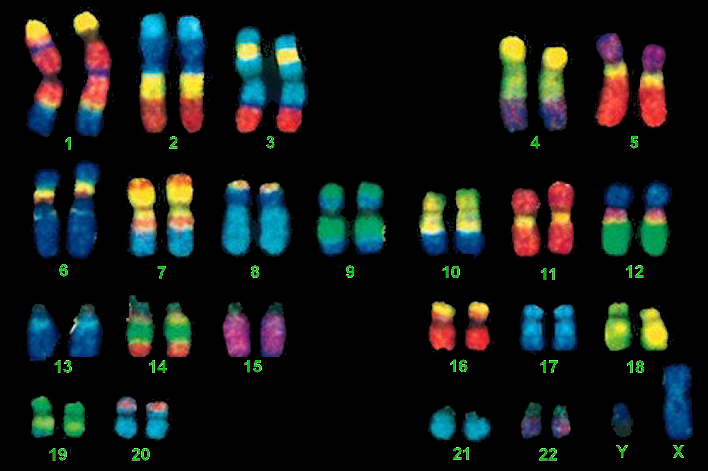

# Li Stephens Algorithm Implementation

  

## Overview
This GitHub repository is dedicated to the implementation of the Li and Stephens algorithm, a statistical method used for chromosome painting in genetic ancestry inference. The algorithm, based on a hidden Markov model (HMM), is designed to model a target haplotype as a mosaic of a haplotype reference panel, aiding in the determination of the ancestry of chromosomes. Our implementation focuses on optimizing this process through improved algorithmic efficiency and is demonstrated using real haplotype data from the 1000 Genomes Project to paint African American sample haplotypes with known European and African ancestries.

## Features
- Two main functions implementing the Li and Stephens algorithm, with the second version (`function2`) optimized for lower computational complexity and enhanced performance.
- Demonstrations on how to perform chromosome painting using a dataset that includes real haplotypes from the 1000 Genomes Project.
- A comprehensive set of unit tests ensuring the reliability of the algorithm.
- Benchmark tests comparing the performance of the original and optimized versions of the algorithm.

## Repository Contents
- `demo.R`: A demonstration script showcasing chromosome painting on a dataset for chromosome paintings.
- `refpanel.txt`, `samples.txt`: Data files used in the demonstration. The `refpanel.txt` contains the haplotype reference panel, while `samples.txt` includes sample haplotypes for painting.
- `src/`: A directory with all the source code, including functions for the forward, backward, and gamma computations of the algorithm.
- `tests/`: Unit tests for verifying the correctness of the implementation.
- `benchmark.R`: Script for benchmarking the performance of the algorithm's different implementations.

## Background
Humans and many other species are diploid, carrying two copies of each chromosome inherited from both parents. These chromosomes undergo recombination, forming new DNA molecules that are mosaics of the original ones. This genetic shuffling allows for the use of chromosome painting to infer the ancestral background of chromosomes by comparing DNA to a haplotype reference panel. This process is critical for understanding genetic diversity and ancestry.

## Implementation Details
The Li and Stephens algorithm uses a hidden Markov model to estimate probabilities that a target haplotype copies from reference haplotypes at specific genetic variants. By modeling the haplotype of interest as a vector and utilizing a fixed haplotype reference panel, the algorithm infers the ancestry along a chromosome by comparing it to known populations. Our implementation provides two versions of the core functions, with the second set (`function2`) designed for improved computational efficiency.

## Getting Started
To use this repository for chromosome painting:
1. Clone the repository to your local machine.
2. Install R and the necessary libraries as listed in the `requirements.txt`.
3. Run `demo.R` to see an example of chromosome painting using the provided dataset.
4. Explore the `src/` directory to understand the implementation details of the Li and Stephens algorithm.
5. Use `benchmark.R` to compare the performance of the two algorithm versions.

## References
- Li N, Stephens M. Modeling Linkage Disequilibrium and Identifying Recombination Hotspots Using Single-Nucleotide Polymorphism Data. Genetics. 2003 Jan;165(4):2213-33.
- The 1000 Genomes Project Consortium. A global reference for human genetic variation. Nature. 2015 Oct;526(7571):68-74.
- Byrska-Bishop M, Evani US, Zhao X, Basile AO, Abel HJ, Regier AA, et al. High-coverage whole-genome sequencing of the expanded 1000 Genomes Project cohort including 602 trios. Cell. 2022 Sep;185(18):3426-40.e19.

This project aims to make chromosome painting accessible and efficient for genetic research, leveraging the power of the Li and Stephens algorithm to uncover the mosaic nature of human ancestry.
